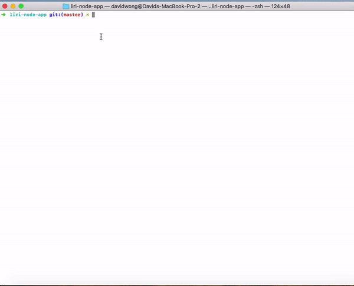
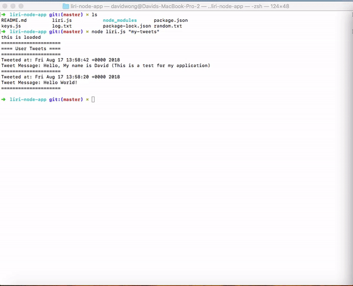
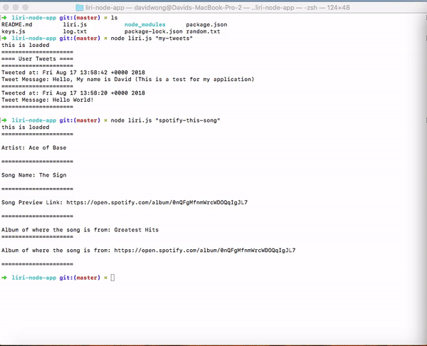

# liri-node-app

This application is created in the purpose of testing node and npm. Similar to SIRI (Speech Interpretation and Recognition Interface) Liri is a lanaguage interpretation and recognition interface. Liri will be a command line node app that takes in parameters and gives you back data. 

### Installation

1. First you'll need the necessary application: Node and a command terminal. 
2. Clone the repository.
3. You will need download the necessary npm packages in the downloaded repository. 


## Packages
These are some of the packages needed to run the application.

1. Request

```npm install request```

2. Twitter

```npm install twitter```

3. Spotify

```npm install spotify```

4. File System

```npm install fs```


## Demonstration 

**The first gif shown below is using the "my-tweets" command to bring up my 10 most recent tweets.**


**The second gif shown below is using the "spotify-this-song" command. However a specific song isn't queried 
so the default search is The Sign by Ace of Base.**


**The third gif shown below is using the "spotify-this-song" command, however this time we are adding a 
custom search of th song named "love song". I made it so that the query would produce 2 song result searches.**

