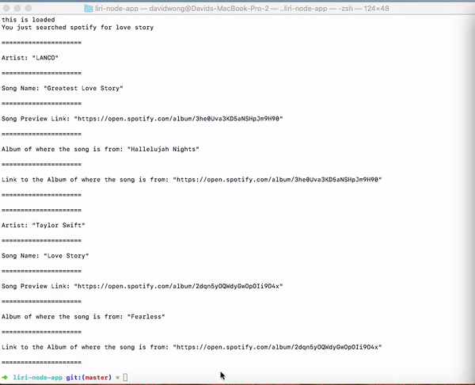
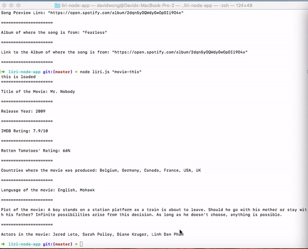
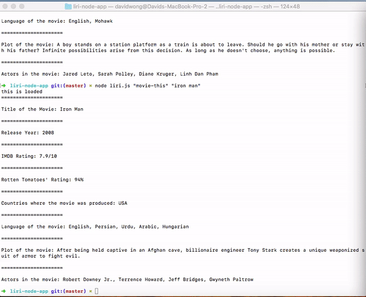

# liri-node-app

This application is created in the purpose of testing node and npm. Similar to SIRI (Speech Interpretation and Recognition Interface) Liri is a lanaguage interpretation and recognition interface. Liri will be a command line node app that takes in parameters and gives you back data. 

### Installation

1. First you'll need the necessary application: Node and a command terminal. 
2. Clone the repository.
3. You will need download the necessary npm packages in the downloaded repository. 


## Packages
These are some of the packages needed to run the application.

1. Request

```npm install request```

2. Twitter

```npm install twitter```

3. Spotify

```npm install spotify```

4. File System

```npm install fs```


## Demonstration 

**The gif shown below is using the "my-tweets" command to bring up my 10 most recent tweets by calling the Twitter API 
through the npm**


**The gif shown below is using the "spotify-this-song".However a specific song isn't queried 
so the default search is The Sign by Ace of Base.**


**The gif shown below is using the "spotify-this-song" command to call Spotify's API, however this time we are adding a 
custom search of the song named "love song". I made it so that the query would produce 2 song result searches.**


**The next gif shown below is using the "movie-this" command, which searches for the movie title, year the 
movie came out, IMDB rating, Rotten Tomato Rating, Country where the movie was produced and more. Because
there was no particular search parameter on the gif below, the default search parameter is Mr. Nobody. 
On the 2nd gif below, we entered a custom parameter "iron man", and the gif shows how the application calls on the omdb 
api, resulting the information given.**





**Lastly we have the "do-what-it-says" command, which uses the 'fs' Node package. The Liri will take the text inside random.txt and then use it to call one of LIRI's commands. Random.txt currently has the 'spotify-this-song' command with "I Want it That Way" as the parameter. The result should be the gif below.**


